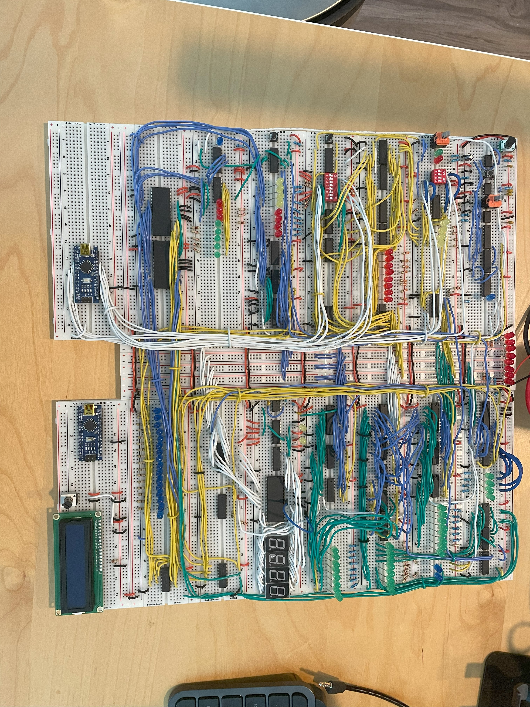
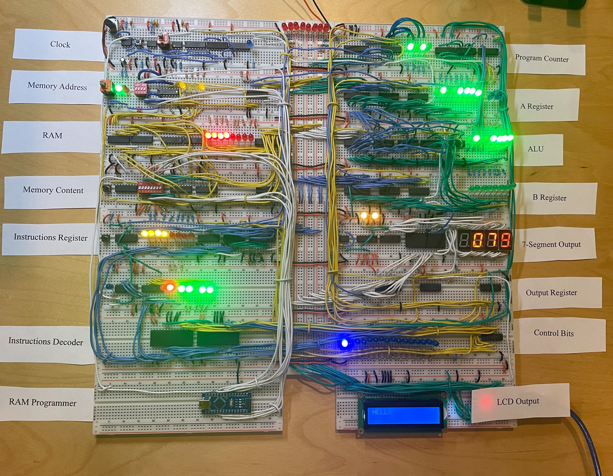
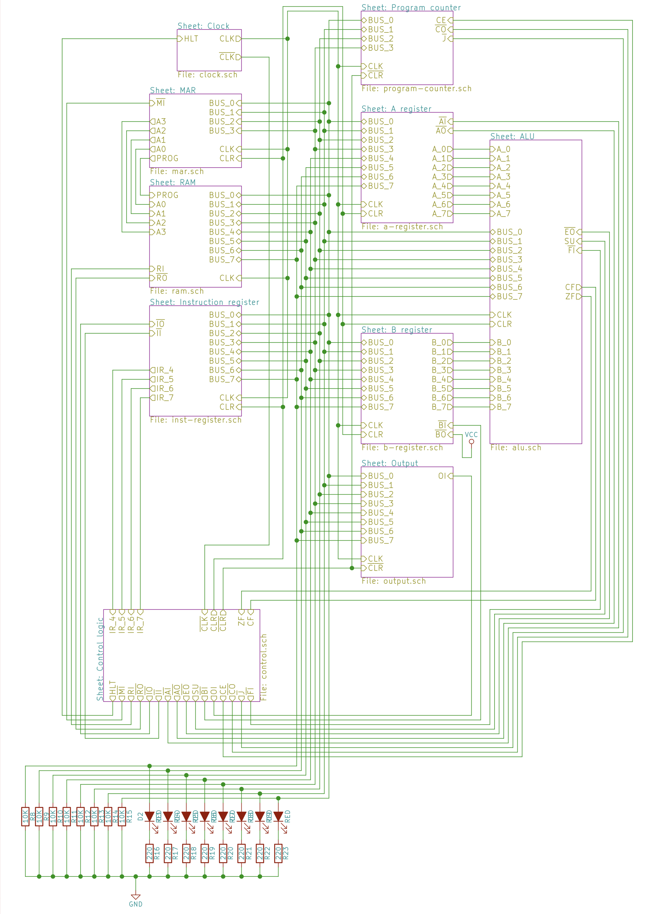

# README

This repository contains all the design files, instructions, and code related to my 8-bit Breadboard Computer. This computer was built entirely on a breadboard, following the instructional series by Ben Eater.

## Project Images:

### High level overview

## Videos:

### Running "Hello" Program
https://www.youtube.com/watch?v=goVngIlzJSU

### Running "Multiplication" Program
https://www.youtube.com/watch?v=3k-tFOvkg04

### Running Fibonacci Sequence on a 8-bit breadboard computer
https://www.youtube.com/watch?v=2aeOgvRTwT8

## Project Overview
This project is a simple 8-bit computer assembled entirely on a breadboard. The computer is capable of running basic programs and demonstrates fundamental concepts of computer architecture such as memory management, instruction decoding, and the fetch-decode-execute cycle.

The design is based on the von Neumann architecture, featuring separate instruction and data memory.

## Components
The computer is comprised of the following modules:

* **Clock Module**: Generates clock pulses to synchronize the operation of the computer.
* **CPU Module**: Executes instructions stored in memory. Includes an Arithmetic Logic Unit (ALU) for performing operations.
* **Memory Module**: Stores instructions and data.
* **Input/Output Module**: Allows for interaction with the computer via switches and LED indicators.

## Device specifications:
* Maximum Clock Speed: 303Hz
* Memory: 16 Bytes
* Turing Complete

## Control Signal
| HLT | MI | RI | RO | IO | II | AI | AO | SO | SS | BI | OI | CE | CO | J | FI |
| -------- | -------- | -------- | -------- | -------- | -------- | -------- | -------- | -------- | -------- | -------- | -------- | -------- | -------- | -------- | -------- |

 

* HLT : Clock Halt
* MI : Memory Address Input
* RI : RAM Input
* RO : RAM OUTPUT
* IO : Instruction Register Output
* II : Instruction Register Input
* AI : A Register Input
* AO : A Register Output
* SO : Sum out / ALU Out
* SS : Sum Subtract Signal / ALU Subtract
* BI : B Register Input
* OI : LED Output Input
* CE : Counter Enable
* CO : Counter Output
* J  : Jump (Counter Load)
* FI : Flag Register Input

## Problems encountered

### (1) Floating Voltages and the Need for Pull Down Resistors
Some pin have floating voltage, and i needs to use pull down resistors to make sure it is ground when no voltage is supply. The cause might be power decoupling capacitors aren't used or are inadequate as power supply noise can cause voltages to float, especially in high-frequency digital circuits.

### (2) Voltage Drop on Power Rails
This problem is characterized by a noticeable decrease in voltage as one moves further away from the power source along the breadboard's power rails. This voltage drop leads to unpredictable behavior in digital circuits, as certain components might not receive the voltage levels necessary for correct operation. 

The solution to this problem was to switch to a higher-quality breadboard, specifically the BB830 breadboard. There can be various causes for this issue, and I believe that the original lower-quality breadboard I was using contributed to it. This could be due to higher resistance stemming from factors such as the use of less conductive materials in the metal strips forming the rows and columns, thinner metal strips, or less reliable connections between the metal strips and the breadboard's pin holes.

### (3) EEPROM Programming Difficulties
The issue primarily stemmed from the unique timing requirements of each EEPROM. Different EEPROMs require different timing sequences for reading, writing, and erasing operations, so understanding these specifics is crucial to successful programming. Unfortunately, initially, I had not taken these timing differences into account, which led to the programming failure.

To resolve this issue, I had to delve into the details provided by the EEPROM's datasheet and adjust the programming to meet the specific timing requirements. This meant carefully studying the datasheet to understand the precise timing diagrams and programming sequences that the EEPROM required.

In addition, I had to ensure that the write-protection feature was disabled during programming. Write-protection is a feature that prevents data on the EEPROM from being modified or erased. While this can be a beneficial feature in certain situations to prevent inadvertent data loss, it poses a problem during programming when you want to write data to the EEPROM. Some EEPROMs even feature software-write-protection, adding another layer to consider during programming.

Finally, I found that using the standard 'digitalWrite' function was not sufficient to meet the required timing for the EEPROM programming. As a result, I had to resort to using direct port manipulations, which allow for faster operation than 'digitalWrite'.

### (4) Discrepancies in Pin Layout for 74HC273E
One of the more perplexing issues I encountered during my build involved the 74HC273E chip, a commonly used octal D-type positive-edge-triggered flip-flops chip. The problem was a discrepancy between the pin layout of the chip I received and the pin layout described in various datasheets I consulted. This unexpected mismatch posed a significant challenge, causing confusion and hindering progress.

In theory, datasheets should provide accurate and consistent information about the components they describe. They are supposed to detail the exact specifications, pin layouts, and other crucial details about the component. However, in this case, the 74HC273E I received had a pin layout that differed from all the datasheets I reviewed.

My realization of this issue came about when I noticed that the input voltages significantly dropped on the bus when I connected the chip. This led me to suspect that the pin layout of the actual chip was different from the one indicated in the datasheet.

Given this observation, I began investigating the possibility that the pin layout was indeed swapped. After careful testing and troubleshooting, I was able to confirm this and adjusted my connections accordingly.

The cause of this discrepancy remains unclear. It could be a manufacturing error, a unique variant of the chip, or even a mislabeling. Regardless of the reason, this unexpected challenge significantly underscored the importance of hands-on testing and troubleshooting in electronics projects.

### (5) Common Ground Issue

The next challenge I faced in the construction of my breadboard computer was related to grounding — specifically, the lack of a common ground between different parts of the system. This issue manifested in a significant discrepancy in the voltage levels between the Arduino Nano, which I was using to program the RAM, and the breadboard computer itself.

I was powering the computer using a 5V power supply, while the Arduino Nano used its own separate power source. However, I found that the 5V output from the Arduino was only registering as 0.3V when it reached the breadboard. This discrepancy was puzzling and problematic.

The cause of the issue can be traced back to the nature of voltages. Voltage is not an absolute value; instead, it is relative. Specifically, a voltage is the difference in electric potential between two points. When the Arduino and the breadboard computer were powered by separate power supplies without a common ground, their voltage potentials were being referenced from different points. This discrepancy was causing the 5V output from the Arduino to appear as only 0.3V on the breadboard.

The solution to this problem involved creating a "common ground" between the Arduino and the breadboard. By connecting the ground (negative) terminal of the Arduino to the ground of the breadboard, I effectively aligned their voltage potentials. This ensured that a 5V signal from the Arduino would register as a 5V signal on the breadboard.

### (6) Lack of Resistors in LED Connections
A further issue I encountered during my breadboard computer build was in the LED connections. According to the instructions given by Ben Eater in his video series, there's no need to add resistors between the ground and the LEDs because the current is already resisted due to the inherent resistance within the integrated circuit (IC) components.

However, in practice, I found this claim to be inaccurate. When I followed this instruction, I observed a substantial power reduction in the circuit. Specifically, the output voltage dropped from 4V to 2V. To rectify this, I added resistors in series with each LED. LEDs need resistors to limit the current flowing through them. 

## Future Improvements
This breadboard computer build has been an exciting and enriching journey. As with any project, however, there is always room for growth and refinement. Here are some improvements I am considering for future iterations of this project:

* **Increase RAM Capacity**: The current configuration utilizes 16 bytes of RAM, which can be quite limiting for running more complex programs or storing larger amounts of data. As a next step, I plan to upgrade the system to have 256 bytes of RAM or even more. This enhancement will significantly expand the range and complexity of tasks that the computer can perform, paving the way for more sophisticated applications and experiments.

* **Add More Decoupling Capacitors**: Another area for improvement is in power supply noise reduction. While the current setup is functional, it can benefit from additional decoupling capacitors. Decoupling capacitors serve to reduce power supply noise and stabilize the voltage supply to ICs, helping to ensure consistent and reliable performance. By adding more of these capacitors, I anticipate that I can further improve the stability and reliability of the computer.

## Credits

I would like to extend my gratitude to Ben Eater for his clear, detailed tutorials that guided this project. This project would not have been possible without his instructional series.
